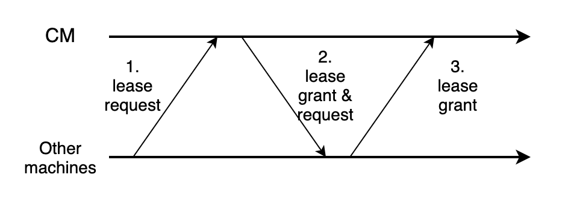

# FaRM

This blog is based on the [paper](https://pdos.csail.mit.edu/6.824/papers/farm-2015.pdf), which introduces the design and implementation of FaRM (Fast Remote Memory). 

## Introduction

FaRM is a main memory distributed computing platform, which can provide distributed transactions with strict serializability, high performance, durability, and high availability without compromise. We all know there have been a lot of distributed system solutions, but all of them make compromises somewhere, like weaker consistency, weaker performance, and so on. In this paper, authors introduce their new designs on transaction, replication, and recovery protocols in FaRM, to make it provide distributed ACID transactions with strict serializability, high availability, high throughput and low latency.

The charm of FaRM mainly comes from its usage of hardware, I think. Compared to other distributed system solutions, FaRM uses hardware as a part of the solution. It makes use of features of Network Interface Card, which would interrupt the CPU to deal with transactions, as well as extra backup batteries to avoid power cut-off. On the software part, they design it carefully to integrate these hardware and reducing CPU loads for higher performance and throughput. These measures include : *reducing message counts, using one-sided RDMA reads and writes instead of messages,*and *exploiting parallelism effectively*

FaRM reduces message counts by using vertical Paxos with primary-backup replication, and unreplicated coordinators that communicate directly with primaries and backups. It uses optimistic concurrency control with a four phase commit protocol (lock, validation, commit backup, and commit primary.

As I mentioned above, with the help of other hardware, the load of CPU could be greatly reduced, and transactions use no foreground CPU at backups. Also, for failure recovery, hardware could not determine whether a lease has expired or not, so that *precise membership* must be maintained and guaranteed. FaRM could distribute recovery across the cluster and do it in parallel on each machine to accelerate recovery. 

## Model and Architecture

FaRM provides applications with the abstraction of a global address space that spans machines in a cluster. Each machine runs application threads and stores objects in the address space. For the application, access to local and remote objects is transparent.

FaRM transactions use optimistic concurrency control, and updates are buffered locally during execution. FaRM also provides strict serializability of all successfully committed transactions, and individual object reads are atomic, that they read only committed data. The consistency check has been deferred to commit time, instead of re-checking consistency on each object read. Of course it requires FaRM applications must handle these temporary inconsistencies during execution.

A FaRM instance moves through a sequence of *configurations* over time as machines fail or new machines are added. It uses a Zookeeper coordination service to ensure machines agree on the current configuration and to store it. But it does not rely on Zookeeper to manage leases, detect failures, or coordinate recovery. 

The global address space is replicated on both primary and backups, and FaRM could tolerate fault as much as one replica available. Each object has a 64-bit version that is used for concurrency control and replication. FaRM uses two-phase protocol to ensure a mapping is valid and replicated at all the region replicas before it is used.

## Distributed transactions and replication

FaRM integrates the transaction and replication protocols to improve performance, as well as primary-backup replication in non-volatile DRAM for both data and transaction logs, and uses unreplicated transaction coordinators that communicate directly with primaries and backups. It uses optimistic concurrency control with read validation.

During the execution phase, trans- actions use one-sided RDMA to read objects and they buffer writes locally. To commit, the below steps are required:

1. *Lock*: The coordinator writes a LOCK record to the log on each machine that is a primary for any written object.
2. *Validate*: The coordinator performs read validation by reading, from their primaries. Once the version of objects having been read but not written changes, the transaction should be aborted. In this, if two transactions read the same objects at the start time, the first could commit and the second would fail and be aborted in this step, because the former one has changed the versions of the objects it writes.
3. *Commit backups*: The coordinator writes a COM MIT- BACKUP record to the non-volatile logs at each backup.
4. *Commit Primary*: After all COM MIT-BACKUP writes have been acked, the coordinator writes a COM MIT- PRIMARY record to the logs at each primary.
5. *Truncate*: Backups and primaries keep the records in their logs until they are truncated.

For *correctness*, committed read-write transactions are serializable at the point where all the write locks were acquired, and committed read-only transactions at the point of their last read. Serializability in FaRM is also *strict*: the serialization point is always between the start of execution and the completion being reported to the application. To ensure serializability across failures, it is necessary to wait for hardware acks from all backups before writing COMMIT-PRIMARY.

it is necessary for the coordinator to wait for a successful commit at one of the primaries before reporting a successful commit to the application. Because the read t is stored at the coordinator, in case of coordinator failure, this is required.

## Failure recovery

FaRM provides durability and high availability using replication, just like many other distributed systems do. All committed state can be recovered from regions and logs stored in non-volatile DRAM. 

Failure recovery in FaRM has five phases described be- low: failure detection, reconfiguration, transaction state recovery, bulk data recovery, and allocator state recovery.

### Failure Detection

FaRM uses leases to detect failures, and expiry of any lease triggers failure recovery. The lease grant requires 3 steps:

Each machine would require lease from CM, and CM would also require lease from them.

### Reconfiguration

The reconfiguration protocol moves a FaRM instance from one configuration to the next. For this part, implementing *precise membership* is necessary, because the server’s CPU cannot check if it holds the lease. After a failure, all machines in a new configuration must agree on its membership before allowing object mutations. This allows FaRM to perform the check at the client rather than at the server.

The reconfiguration contains below steps:

1. *Suspect*: When a lease for a machine expires at the CM, it suspects that machine of failure and initiates recon- figuration. At this point it starts blocking all external client requests.
2. *Probe*: The new CM issues an RDMA read to all the machines in the configuration except the machine that is suspected.
3. *Update Configuration*: After receiving replies to the probes, the new CM attempts to update the configuration data stored in Zookeeper.
4. *Remap regions*: The new CM then reassigns regions previously mapped to failed machines to restore the number of replicas.
5. *Send new configuration*: After remapping regions, the CM sends a NEW- CONFIG message to all the machines in the configuration.
6. *Apply new configuration*: When a machine receives a NEW- CONFIG with a configuration identifier that is greater than its own, it updates its current configuration. It also starts blocking requests from external clients
7. *Commit new configuration*: All members now unblock previously blocked external client requests and initiate transaction recovery.

### Transaction state recovery

FaRM recovers transaction state after a configuration change using the logs distributed across the replicas of objects modified by a transaction. This involves recovering the state both at the replicas of objects modified by the transaction and at the coordinator to decide on the outcome of the transaction. 

1. *Block access to recovering regions*: When the primary of a region fails, one of the backups is promoted to be the new primary during reconfiguration. Requests would be blocked until all transactions that updated it have been reflected at the new primary.
2. *Drain logs*: to ensure that all relevant records are processed during recovery.
3. *Find recovering transactions*: A recovering transaction is one whose commit phase spans configuration changes, and for which some replica of a written object, some primary of a read object, or the coordinator has changed due to reconfiguration. All machines must agree on whether a given transaction is a recovering transaction or not.
4. *Lock recovery*: In parallel, the threads in the primary fetch any transaction log records from backups that are not already stored locally and then lock any objects modified by recovering transactions.
5. *Replicate log records*: The threads in the primary replicate log records by sending backups the REPLICATE-TX- STATE message for any transactions that they are missing.
6. *Vote*:  The coordinator for a recovering transaction decides whether to commit or abort the transaction based on votes from each region updated by the transaction. These votes are sent by the primaries of each region.
7. *Decide*: The coordinator decides to commit a transaction if it receives a commit-primary vote from any region. Otherwise, it waits for all regions to vote and commits.

For correctness, the key idea is that recovery preserves the outcome for transactions that were previously committed or aborted. A transaction is committed when either a primary exposes transaction modifications, or the coordinator notifies the application that the transaction committed. A transaction is aborted when the coordinator sends an abort message or notifies the application that the transaction has aborted.

### Recovering data

Data recovery is not necessary to resume nor- mal case operation, so we delay it until all regions become active to minimize impact on latency-critical lock recovery.  FaRM begins data recovery for new backups in parallel with foreground operations. To reduce impact on foreground performance, recovery is paced by scheduling the next read to start at a random point within an interval.

Each recovered object must be examined before being copied to the backup. The steps contain:

1. check version number (greater than local)
2. lock local version with a compare-and-swap
3. update object state
4. unlock

## Summary

FaRM is the first system to simultaneously provide high availability, high throughput, low latency, and strict serializability with a new fast recovery protocol and an optimized transaction and replication protocol. To be more specific, it is a distributed main memory computing platform for modern data centers that provides strictly serializable transactions with high throughput, low latency, and high availability. Key to achieving this are new transaction, replication, and recovery protocols designed from first principles to leverage commodity networks with RDMA and a new, inexpensive approach to providing non-volatile DRAM.