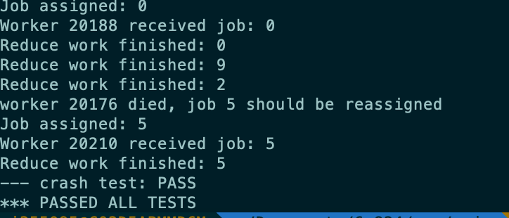

# MapReduce introduction and implementation

This part is all based on the paper [MapReduce](https://pdos.csail.mit.edu/6.824/papers/mapreduce.pdf), which is absolutely worth carefully reading.

## What is MapReduce

MapReduce is a model to process tasks in parallel without conflicts and errors. MapReduce contains two main part:

1. **Coordinator**, used to participate and assign jobs to workers and responsible for error handling.
2. **Worker**, used to process subtasks assigned to it and report the result to coordinator.

And as for the worker, there are also two parts:

1. **Map Function**, used to process tasks to generate intermediate results. The origin tasks could be an article, and the     intermediate result could be a set of key-value pairs.
2. **Reduce function**, used to process the intermediate results, like to make a statistic of these. For example, the intermediate     results is the frequency of each word in the article, while in the result the frequency is always 1, because the results has not been merged. And the Reduce function does the merge job.

In fact, the concept is relatively, while in practice, there are a lot of difficulty. The matured mechanism should be successful to handle exceptions like what if some workers die, what if some new workers join the cluster, what if network jam happens and so on. 

## Some details about MapReduce

There are a lot of details in the implementation:

1. The origin task, like a dozen of articles requiring counting the frequency of each word, could be naturally split by each     article itself. While the intermediate results, should also be split, and this could be done by calculating the hash code of each key-value pair and aggregate all the pairs with the same hash code, and then stored them into a single file. The single file could then be processed by Reduce function. A useful way is to calculate the raw hash code of the key and calculate the reminder of the hash code by the number of workers of Reduce job. And each worker could then process one file containing intermediate results than according to the index, or offset I named it.
2. The intermediate results are stored in files on local disks, and to avoid reading broken files or unfinished files, a temporary     file name pattern was introduced. It requires that all the intermediate files should be named with a temporary name, and after the transaction, they would be renamed to proper names, which guarantees the atomicity.

## Lab1 implementation

In this lab, we are required to finish a MapReduce demo: counting the word frequency in 8 different e-books. The counting part has been implemented, and the only task for us is to finish the Coordinator and Worker. 

#### Basic design

Just as I described, Map function and Reduce function behave clearly, but when implemented, there are a lot of tricks:

1. The structure of message varies between Coordinator and Worker. In this part, I require the Worker to provide its unique name: its PID, used to record its status in Coordinator. There are two kinds of request the Worker could send: 

   1. the request to fetch a new task from Coordinator.
   2. The message to let the Coordinator know that a task has been finished. And in response, the Coordinator need to provide the instruction for Workers to do, like a Map task or Reduce Task. Other options include that the Coordinator has no tasks for Workers temporarily, or a message to inform Workers that all tasks has been finished, and Workers should exit.

2. For the Coordinator: it should assign tasks to Workers, and track each task and Worker. To track each Worker, the Coordinator should record the PID of the Worker and check its status in every round of checking whether all the tasks have been done. There is a counter for each Worker, and in each round the Coordinator would check the counter. If the counter of one certain Worker has reached the threshold, the Worker would be marked as dead, and the job assigned to it should be     rescheduled. In fact, in the paper, when a worker dies, all the tasks, including past tasks assigned to it and its current tasks should all be processed again by other workers, but in my implementation, it is unnecessary to dealt with past tasks, though it also could done easily. 

   Coordinator’s working stage has been split into 2 parts: the **Map Stage** and the **Reduce Stage**. In the former one, the coordinator sends the file name of each e-book to Workers, and waits for all the tasks to finish. If a Worker comes to ask     for a new task when all the tasks have been assigned while not finished, the Coordinator would tell the Worker to wait, until the stage of the Coordinator has been switched to Reduce Stage. Then the offset of intermediate files would be sent to Workers asking for new tasks, and they could start reading intermediate files whose file names end with the offset.

   In this way, we then know that the Coordinator should also keep a record of each Map task and Reduce task to switch stages. The data structure map of *PID-task*, *task-status* and array of each kind of tasks are necessary.

As we can see, the implementation of both Coordinator and Worker is crystal clear, as they have been described in the paper. While the error handling cost most of my efforts. In fact, the rename method provided by the guideline of this lab is useless with my implementation, because I guarantee that all the tasks would not be marked as finish until the finish message has been sent to the Coordinator. And because Workers would not begin Reduce process until the Coordinator allow them to do so when all the Map tasks have been finished, it is impossible to read broken files. 

#### The design of status of Worker and Coordinator

In my past design, I required the Worker to keep the status of itself, and the Coordinator assign job according to the Worker's status only, but it then be proved a bad design, because when some Workers finished their Map tasks and there are no unassigned Map tasks in Coordinator, these Workers would go to the status of Reduce, which would always ask for Reduce tasks from Coordinator. But currently if the Worker processing the unfinished Map task died, the task returned to the Coordinator, and because all other Workers ask for Reduce tasks only, the remaining Map task would never be assigned successfully. The key is: for the Worker, there lacks a mechanism to switch back to a former status, and it could be redundant on both Worker and Coordinator sides: the Worker should always check the task category(Map or Reduce) and decide how to deal with it, and the Coordinator should always check which kind of task should be assigned, no matter what status the Worker has. So that the status of Workers is unnecessary, it is OK for them to receive no matter what kinds of tasks from the Coordinator and process it. The Coordinator only need to guarantee that no Reduce tasks would be assigned before all Map tasks have been finished, and tasks could be assigned freely.

#### The detail of the counter of Workers

It is a map maintained by the Coordinator, so every time it receives the message from Worker, it would check in the map, and insert a new record or update an existing one, depending on whether it has received at least one message from the Worker and the Worker had not died before. If it is a new Worker, the Coordinator writes it to the map with value 0, indicating its age is 0; if it is not, the Coordinator updates its record and set the value as 0, which means the Worker has proved its aliveness. In each round, which is the check from external calls about whether the Coordinator has finished its tasks, the Coordinator would check the map, and update all the records in map by increasing its age by1. If a value reaches the predefined threshold, the Worker would be thought as dead, and its current task should be retrieved. Also, the Worker would be removed from all the records maintained by the Coordinator, including the counter.

#### Why no Windows and some other things

I used a MacBook pro to run the code and tests, because the test script just would not run on Windows environment. Also, even on MacOS, there are something for me to do: 

1. Install the Go environment.
2. Update the bash version from 3.x.x to 5.x.x, because the default version of bash of zsh does not support some commands in the test script.
3. Some logs to record the status of the Worker and Coordinator are necessary, and then the output of test script could be too much for reading and analyzing in command directly. So that it is highly recommended to redirect all the output to a txt file for easily reading and reusing.

The result is truly delightful, especially after a long period of hard working:

