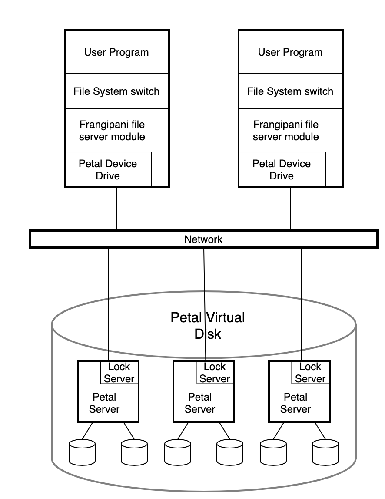

# Frangipani

This blog is based on the [paper](https://pdos.csail.mit.edu/6.824/papers/thekkath-frangipani.pdf) in MIT 6.824 course. I have to say the name is wired and hard to remember. :)

## Introduction

Frangipani is a file system built upon a reliable shard virtual disk, which is maintained by Petal. That is to say, the whole system is a two-layer structure. The high availability, high performance, fault-tolerance and some other desired features are guaranteed by them both.

Frangipani is a new scalable distributed file system that manages a collection of disks on multiple machines as a single shared pool of storage. This is the official definition. It has some superior features:

1. consistent views for all users
2. easy to add more servers
3. easy to add new users
4. full and consistent backup
5. fault-tolerate and recover automatically

The layers of the whole system looks like this:

```
User Program | User Program | User Program
========================================================
Frangipani File Server | Frangipani File Server
========================================================
Distributed Lock Server | Petal Distributed Disk Service
========================================================
Physical Disks
```

Because of the two layer design, the whole structure of the system is a little bit complex:



By definition, changes made to a file or directory one machine are immediately visible on all others. Each server module runs with in the operating system kernel. All the file servers read and write the same file system data structures on the shared Petal disk, but each server keeps its own redo log of pending changes in a distinct section of the Petal disk. Servers would not communicate with each other directly, but via the underlying Petal disk, just like Raft.

The Petal servers run cooperatively to provide Frangipani with large, scalable, fault-tolerant virtual disks. And the lock service is a general-purpose service that provides multiple-reader/single-writer locks to clients on the network.

Frangipani provides client/server configuration for usage. The first reason is security, because Frangipani must run on trusted operating system. The second reason also relates to it, which makes Frangipani hard to be portable.

Some features, like high availability and scalability are provided by Petal. Frangipani would not care about where the file is placed, and Petal would take care of it. This greatly reduce the coherence, and accelerate the development process of the file system and enhance its reliability and maintenance.

As for the disk part, Frangipani uses the large, sparse disk address space of Petal to simplify its data structures, and Petal commits physical disk space to virtual addresses only when they are written. The internal data on Petal is not stored in sequence, but the virtual disk is divided into server regions, and each region would store different kinds of data, including *parameters*, *logs*, *allocation bitmaps*, *inodes*, *small blocks* and *large blocks*.

## Logging and Recovery

Frangipani uses write-ahead redo logging of metadata, while user data would not be logged. Each Frangipani server has its own private log in Petal. Before each metadata update, Frangipani would firstly creates related log in its records, and these logs would be written to Petal periodically *in the same order* that the updates they describe were requested. 

If a Frangipani server crashes, the system eventually detects the failure and runs recovery on that server's log. As long as the underlying Petal volume remains available, the system tolerates an unlimited number of Frangipani server failures. 

There could be troublesome when dealing with multiple logs. Like a server updates a file, it crashes, and another server updates the log. So when the crashed server's log is used for recovery, we must be very careful.

1. Frangipani could guarantee that updates requested to the same data by different servers are serialized.
2. Frangipani also guarantees that recovery never replays a log record describing an update that has already been completed. It maintains a version number for each block, and only applies the log with a greater version number than current one.
3. At any time only one recovery demon is trying to replay the log region of a specific server.

Frangipani's logging is not intended to provide high-level semantic guarantees to its users. Its purpose is to improve the performance of metadata updates and to speed up failure recovery. To be more specific, Frangipani is not a log-structured file system; it does not keep all its data in the log, instead maintaining conventional on-disk data structures, with a small log as an adjunct to provide improved performance and failure atomicity.

## Synchronization and Catch Coherence

Because multiple Frangipani servers could modify shard data at the same time, Frangipani uses multiple-reader/single-writer locks to implement the necessary synchronization. When the lock service detects conflicting lock requests, the current holder of the lock is asked to release or downgrade it to remove the conflict. In other words, the lock holder would not release the lock by itself, but should **be required** to do that.

There are two kinds of lock: A read lock allows a server to read the associated data from disk and cache it. If a server is asked to release its read lock, it must invalidate its cache entry before complying. A write lock allows a server to read or write the associated data and cache it, and if server is asked to release its write lock or downgrade it to a read lock, it must write the dirty data to disk before complying.

The on-disk structures are divided into logical segments with locks for each segment. And a single disk sector does not hold more than one data structure that could be shared. Also, each log is a single lockable segment. But what if operations that require atomically updating several on-disk data structures covered by different locks? To avoid deadlock, these related locks must be held together, and the whole process is divided into two phases:

1. determines what locks it needs
2. sorts the locks by inode address and acquires each lock in turn

What's more, the server would check whether any objects it examined in phase one were modified while their locks were released. If so, it releases the locks and loops back to repeat phase one.

These locks are provided by the lock service. Frangipani requires only a small, generic set of functions from its lock service. The lock service provides multiple-reader/single-writer locks. Locks are sticky; that is, a client will generally retain a lock until some other client needs a conflicting one.

The lock service deals with client failure using leases. When a client first contacts the lock service, it obtains a lease. All locks the client acquires are associated with the lease. Each lease has an expiration time, and the client must renew its lease before the expiration time, or the service will consider it to have failed. 

The lock service itself is total distributed for fault tolerance and scalable performance. The lock service organizes locks into *tables*, and each file system has a table associated with it. When the file system is unmounted, the clerk closes the lock table.

The distributed lock service uses heartbeat message to detect failures, and could tolerate minority failure. Locks are distributed on different lock servers, and sometimes they could be reassigned for load-balancing or other reasons.

When a Frangipani server crashes, the locks that it owns cannot be released until appropriate recovery actions have been performed. When the lease expires, the lock services would require another Frangipani to perform recovery and release all related locks.

## Management

It is pretty easy to add and remove servers from the cluster. The newly added server need only be told which Petal virtual disk to use and where to find the lock service, and the server to be removed could be shut down directly to be removed from the cluser.

It is also convenient to make a snapshot. Petal allows snapshot at any point to generate a same virtual disk, which is read-only. It uses copy-on-write techniques for efficiency, and a snapshot always reflects a coherent state. In this way, we could backup the Frangipani system by by taking a Petal snapshot, because all Frangipani logs are stored on Frangipani disks. To restore the system, we can just copy it back to a new Petal virtual disk and run recovery on each log. But there is still a requirement for Frangipani to create consistent snapshots, that is all requests from Frangipani should be terminated for a while until the snapshot process finishes. A **barrier** mechanism is introduced here, and only after all servers enter the barrier, would the snapshot begin. There is a global lock to identify snapshot, and each update request would acquire this lock in shared mode, while the snapshot request (backup process) acquire it in exclusive mode. When the server is required to release the lock, it knows a snapshot is going to start, and it  enters the barrier by blocking all new file system calls that modify data, cleaning all dirty data in its cache and then releasing the lock. After all servers enter the barrier, the snapshot begins, and then the lock would be released by the process. All the waiting server would acquire the lock again, and normal operations could thus continue.

## Summary

The Frangipani file system provides all its users with coherent, shared access to the same set of files, yet is scalable to provide more storage space, higher performance, and load balancing as the user community grows. It remains available in spite of component failures. It requires little human administration, and administration does not become more complex as more components are added to a growing installation.

Frangipani was feasible to build because of its two-layer structure, consisting of multiple file servers running the same simple file system code on top of a shared Petal virtual disk.

