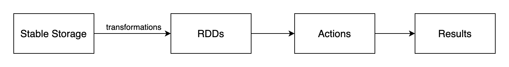

# Spark

This blog is based on the [paper](https://pdos.csail.mit.edu/6.824/papers/zaharia-spark.pdf) introduced in MIT 6.824 course requirements, which introduces the concept of Resilient Distributed Datasets, as well as its implementation named Spark. 

## Introduction

Resilient Distributed Datasets (RDDs) is a distributed memory abstraction that lets programmers per- form in-memory computations on large clusters in a fault-tolerant manner. It keeps data in memory to improve performance, and provides a restricted form of shared memory, based on coarse-grained transformations.

The idea of RDDs comes from the requirement that in some scenarios, intermedia results are needed for further computation. Former designs could not deal with it unless make these data written into external storage system, like a database. In this way, here comes the design of RDDs. RDDs are fault-tolerant, parallel data structures that let users explicitly persist intermediate results in memory.

RDDs provide an interface based on coarse-grained transformations. RDDs could make use of former information from other RDDs to re-compute the partition if it is lost, which could greatly accelerate the fault recovery without maintaining any replicas.

 RDDs are a good fit for many parallel applications, because these applications naturally apply the same operation to multiple data items. In other words, for those applications that apply different operations to different items, RDDs would not be suitable.

### RDD Abstraction

Formally, an RDD is a read-only, partitioned collection of records. RDDs can only be created through *deterministic* operations on either (1) data in stable storage or (2) other RDDs. RDD has enough information about how it was derived from other datasets (its *lineage*) to *compute* its partitions from data in stable storage.

### Spark Programming Interface

Spark exposes RDDs through a language-integrated API, where each dataset is represented as an object and transformations are invoked using methods on these objects. The whole process of Spark to deal with data could be like this:

Spark could only load data needed from external storage, instead of the whole datasets. For example, we can require Spark to load data which contains `error` in the log, and this would be exactly what we get after loading, and the original datasets would not be loaded into RAM.

### Advantages of the RDD Model

RDDs can only be created (“written”) through coarse-grained transformations, which allows for more efficient fault tolerance. Furthermore, only the lost partitions of an RDD need to be recomputed upon failure, and they can be recomputed in parallel on different nodes, without having to roll back the whole program.

A second benefit of RDDs is that their immutable nature lets a system mitigate slow nodes (stragglers) by running backup copies of slow tasks as in MapReduce.

## Spark Programming Interface

Spark uses Scala as the programming language, which is base Java VM. To use Spark, developers write a *driver program* that connects to a cluster of *workers*. The driver defines one or more RDDs and invokes actions on them. Users provide arguments to RDD operation like map by passing closures. Scala represents each closure as a Java object, and these objects can be serialized and loaded on another node to pass the closure across the network.

RDDs themselves are statically typed objects parametrized by an element type. For example, RDD[Int] is an RDD of integers.

## Representing RDDs

Ideally, a system implementing RDDs should provide as rich a set of transformation operators as possible. In Spark's design, there is a simple graph-based representation for RDDs that facilitates these goals. It could support a wide range of transformations without adding special logic to the scheduler for each one, which greatly simplified the system design.

 The designers propose representing each RDD through a common interface that exposes five pieces of information: a set of partitions, which are atomic pieces of the dataset; a set of dependencies on parent RDDs; a function for computing the dataset based on its parents; and metadata about its partitioning scheme and data placement.

An interesting points is how to represent dependencies between RDDs. The designers classify it into two types: narrow dependencies, where each partition of the parent RDD is used by at most one partition of the child RDD, wide dependencies, where multiple child partitions may depend on it.

Distinctions: First, narrow dependencies allow for pipelined execution on one cluster node, which can compute all the parent partitions; wide dependencies require data from all parent partitions to be available and to be shuffled across the nodes using a MapReduce-like operation. Second, recovery after a node failure is more efficient with a narrow dependency, as only the lost parent partitions need to be recomputed; but for wide dependencies, a complete re-execution is required.

## Implementation

Spark could share resources with Hadoop, MPI and other applications. Each Spark program runs as a separate Mesos application, with its own driver (master) and workers, and resource sharing between these applications is handled by Mesos.

For the job scheduler, Spark’s scheduler uses the representation of RDDs described above, which assigns tasks to machines based on data locality using delay scheduling. If a task fails, Spark would re-run it on another node as long as its stage’s parents are still available.

For memory management, Spark provides three options for storage of persistent RDDs: in-memory storage as deserialized Java objects, in-memory storage as serialized data, and on-disk storage. To manage the limited memory available, Spark uses an LRU eviction policy at the level of RDDs. When a new RDD partition is computed but there is not enough space to store it, Spark would evict a partition from the least recently accessed RDD, unless this is the same RDD as the one with the new partition.

For support of checkpointing, it is always useful for RDDs with long lineage graphs containing wide dependencies. In contrast, for RDDs with narrow dependencies on data in stable storage, checkpointing may never be worthwhile. If a node fails, lost partitions from these RDDs can be recomputed in parallel on other nodes, at a fraction of the cost of replicating the whole RDD. Finally, the read-only nature of RDDs makes them simpler to checkpoint than general shared memory. Because consistency is not a concern.

## Summary

RDDs can *efficiently* express a number of cluster programming models that have so far been proposed independently. It is an efficient, general-purpose and fault-tolerant abstraction for sharing data in cluster applications, which offers an API based on coarse-grained transformations that lets them recover data efficiently using lineage.