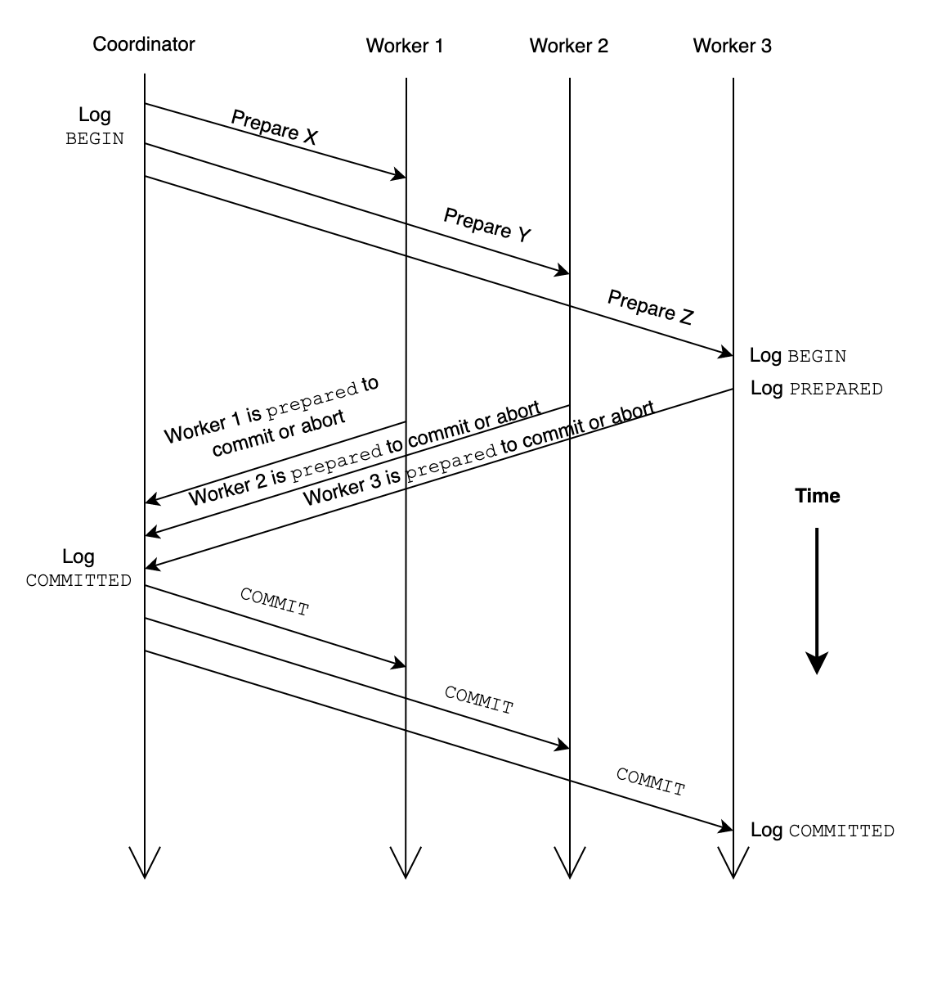

# Concurrency, Locking and Distributed Transaction

This reading [material](https://ocw.mit.edu/resources/res-6-004-principles-of-computer-system-design-an-introduction-spring-2009/online-textbook/) is borrowed from operating system lecture, but some necessary knowledge of transaction is mentioned in the textbook, including general concepts, two different locking solutions and distributed transaction.

## Concurrency condition requirements

There are two of them:

1. sequence coordination
2. before-or-after coordination

The first one is stronger than the second one, because it requires two operations *must* happen in a fixed order. And the second one allows that two operations could happen in any order, as long as they are *mixed* together. The most classic example is about the printer. The printer would not care about which printing job comes first, but it does care that it should not deal with two jobs at the same time.

In programming, this is reflected on shared variables, and each threads touching a shared variable must acquire a lock before it could do something. This is used to guarantee that multiple threads would not modify or read a same variable at the same time, which would cause chaos.

So how should we define *correctness* for concurrent operations? The answer is *if every result is guaranteed to be one that could have been obtained by some purely serial application* of those same actions. We can prove that first, the old state is correct; second, the transform is correct; and finally, the new state must be also correct.

The before-or-after atomicity has the effect of serializing the actions, but it does not guarantee the order of inner transform. In fact, only the final state could be guaranteed correct. Fortunately, for most time we only care about the final state, instead of inner process, though sometimes different inner transform orders could lead to different performance.

There are also some requirements stronger than serializability, like *external time consistency*, which requires the very order of two before-or-after operations if there are evidences; and *sequential consistency*, the result should be as if the instructions were executed in the original order specified by the programmer.

The size of operation is also important. Sometimes a transaction could involve multiple operations, which means they must be finished *all-or-nothing*.

## Locking

In this chapter, we mainly focus on two kinds of locking: simple locking and two-phase locking.

### Simple Locking

It has two rules: 

1. each transaction must acquire a lock for every shared data object it intends to read or write before doing any actual reading and writing
2. it may release its locks only after the transaction installs its last update and commits or completely restores the data and aborts

Generally speaking, in simple locking protocol, each process is required to acquire it needs in its next transaction before it could take action. And there is a *lock set* to maintain all the locks. It also guarantees that in there are no overlapping locks in the lock set. In this way, once the process acquires its needed locks, it could do what it wants. And at the same time, there are many other processes holding different locks dealing with their own requests in parallel. In this way, the simple locking discipline ensures that this transaction runs completely after the preceding one and completely before the next one, because these running processes have no conflicts.

But there is a flaw for simple locking. To determine what locks it needs in the transaction, it has to read a lot of data objects; and to read these data objects, it has to acquire more locks. In this way, the process would finally hold more locks than it really needs. And because only after it finishes the transaction, would it release these locks, it could worsen the overall performance.

### Two-Phase Locking

So how to improve performance? Why can't we just release the lock we do not need anymore after using it? The answer is yes, and it comes to the two-phase locking protocol.

This protocol avoids the requirement that a transaction must know in advance which locks to acquire. The two-phase locking discipline allows a transaction to acquire locks as it proceeds, and the transaction may read or write a data object as soon as it acquires a lock on that object. Also, it could release the lock once it finishes related operations and knows exactly it would **never** use it in the transaction. It is critical for the transaction to guarantee would not acquire the same lock after it releases the lock. Because related data object could be modified in the gap.

In this way, the two phases of this protocol could look like this: in phase one, the transaction acquires more and more locks as it needs; in phase two, the transaction releases more and more locks after using related data objects. A lock manager can implement two-phase locking by intercepting all calls to read and write data.

Of course, as we could notice, there could be a deadlock in two-phase locking protocol. For example, two transactions both wants to acquire each other's lock. The external observer would take care of it. It could detect deadlocks and break the deadlock by terminating a transaction.

The two-phase locking protocol definitely improves performance. For example, if transaction *A* acquires lock *a* and *b* now, and in simple locking protocol, it would not release either lock until the whole transaction finishes. But in two-phase locking protocol, *A* could release *a* immediately after it finishes related operation, as long as *A* confirms that it would not use the data in the transaction, and anther transaction *B* could acquire lock *a* and starts its operation before transaction *A* has finished. 

## Distributed Two-Phase Commit

It is always hard to design distributed transactions, because everything could be unreliable: the coordinator, the worker, the network and so on. In this way, the two-phase commit is necessary, just like three-way handshake in TCP.

The coordinator would create a higher-layer transaction and each of the workers is to perform a transaction that is nested in the higher-layer transaction, and thus we need a distributed version of the two-phase commit protocol. The whole process looks like this:

If there are *N* workers, there could *3N* messages to commit a transaction. Also there are some other alternative: there could be a fourth phase that requires workers to send an acknowledgement message to inform the coordinator that the worker has committed the transaction. Because without this phase, the coordinator must remember its outcomes in case of that one or multiple workers do not receive the commit message and resend the PREPARED message again. Or there is another solution: the coordinator answers any inquiry about a non-existent outcome record by sending a COMMITTED response. In this way, no the space to hold outcome records could be saved and these records could be destroyed after commit, so that additional fourth phase is unnecessary. 

There are still unsolved problems. For example, what if the coordinator crashes after it sends the PREPARE message but  before sending the COMMIT or ABORT message to the worker. In this scenario, the worker would be left in the PREPARED state with no way to proceed. This is known as the *dilemma of the two generals*.

## Summary

This reading material simply introduces locking and distributed transaction. Notice that two-phase locking and two-phase locking are totally different concepts. The former one is a scheme for acquiring locks for records in a transaction; it is useful in non-distributed setting and distributed setting. The latter one, however, is a scheme to execute a transaction across multiple machine,
where each machine has some of the records used in the transaction.