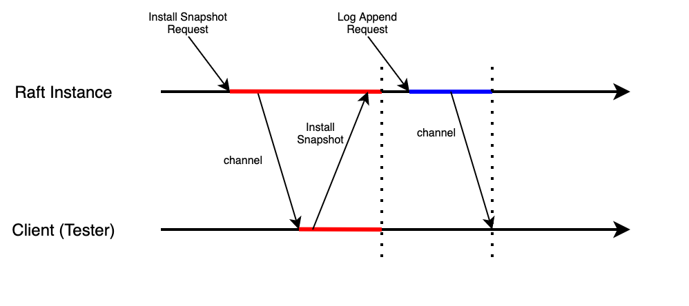

# Key-Value Raft & Lab 3

Lab 3 is based on the implementation of Raft in Lab2, and divided into two parts. The goal of Lab3 is to build a fault-tolerant Key-Value database with Raft, so we need to build a service interacting with Raft instances.

## Structure

In the KVRaft system, there are three kinds of roles:

1. **Raft instance**: working as the foundation and replicating operation logs
2. **Server**: interacting with Raft instances directly. In real world, each server instance (or program) collaborates with a Raft instance on the same server, so that they can interact with each other directly
3. **Clerk**: sending operation requests to servers, providing interfaces for clients (test program)

There is a simple overview of the whole structure:

As you can see, each client is paired with exactly one clerk, and there could be multiple client-clerk pairs.

## Basic rules

There are some rules for our system. Unlike ZooKeeper, no matter what kinds of operations, read or write, should be all directed to the leader. In this way, the clerk should figure out which server connects with the Raft leader by trying each one. It means that though there could be multiple clerks, they all send requests to the same server, if there is no leader change.

In practice, the client, test program, would call server's interfaces of write or read operations directly by invoking related functions. These invocation, however, is **blocked**, or **synchronous**. When the test program calls clerk's interface to do an operation, it will wait until the result of the operation returns, and no other operations would be done before this. This is very important, and is also one of our design principles.

The server, however, behaves more complicated. First, not all the servers could communicate with Raft instances directly, or they could, but should not. Only the server that connects with Raft leader could send logs to Raft instance, the leader. Each server maintains its own KV database in memory, as the state machine. Every log it receives will eventually be written into its database, as well as its peers'. We replicate these operations logs to guarantee the status of the state machine should be synchronized with our Raft records. In this way, only the requests related with the committed log from Raft, which makes the operation valid and persisted. In other words, though the server receives requests from the clerk, it should not write these requests to its database until they are **committed** by Raft. In the above diagram, you can see that the server submit the log to Raft instance (leader), and the Raft instance informs it after the logs has been committed with channel message.

## Implementation

Compared with Raft's implementation, it is relatively easy to build the service upon it. However, there is still something requiring notice:

### Message communication between server and Raft instance

It is kind of tricky of this interaction between the server and Raft instance. As we discussed above, the message receiving/responding and commitment confirmation are separated. That is to say, the server should wait for the channel message to inform it that related log has been committed, and the operation could be applied to its database. This process, however, could not be done in the function of calling Raft's `Start()` function, because there is only one channel (*external channel*) between Raft instance and server, but there could be multiple calls at the same time: they could not hold the channel all together and receive the message exactly they want. So that I designed a separated listener function, starting as goroutine, and making it reads message from the only channel. Once it receives a message from the channel, it will inform related RPC handler and thus the request could be completed and returned.

But how? How to inform related RPC handler? The answer is to use another channel to send message to the handler. Each time the handler submit a log to Raft, a related channel (*inner channel*) would be created and stored in a map with key equal to the index of the log. The hander just waits for a message for the inner channel. And when the listener receives a commitment message, it would apply related operation to the database, search in the map and send a message to the correct inner channel. Then the handler could receive the message, and finish its job.

There is one thing worth noticing: it is natural to hold the lock when submitting logs to Raft, but it is necessary to **release** the lock when waiting for message from the inner channel, or the listener could be blocked when operating on the database (deadlock).

### Duplicated operation requests

Because of network failure, the requests could be delayed, reordered, and even lost. To be more specific, the network failure would only influence the blue line annotated on the above diagram. We have solved the network failure between Raft instances in Lab 2, and in Lab 3, we need to focus on the network failure between clerk and server.

The first step is to find out the consequence of network failure between clerk and server. That is the clerk could resend the request over and over again, and finally it will get the answer. But unless all other requests except exactly one are lost, the same requests would finally arrive at the server and be submitted to Raft, which is awful, because related commitments could destroy the correctness of the state machine. To avoid this, I make use of the fact that requests are sent to clerk one by one, and in this way, I mark each request with a unique *ClientId* and a unique *SeqId*. The ClientId is generated for the clerk randomly at startup, and SeqId is a increasing number generated for each request. In this way, ClientId and SeqId together could exactly identify a request.

I record the **latest SeqId** for each client in a map, whose key is the ClientId. And every time the server receives a request, it would compare the SeqId of the request with the one in map owing the same ClientId. This is valid because in each clerk, requests are sent in sequence, and unless the former one has been finished and returned, the latter one would not be sent. If the server finds out that the SeqId of the request is smaller than or equal to the SeqId in record, it knows it has received a stale request, and then it would reply immediately without submitting to Raft.

### Timeout setting for RPC handler

Remember the truth that a new Raft leader would not commit logs from its former terms? This could lead to a RPC handler to wait for the commit message forever if no new log in the new leader's term is committed. This is deadlock, and we can solve it by setting a timeout threshold for waiting for a message from the inner channel. The RPC handler would return directly and close channel with information telling the clerk to send request again.

However, there is a flaw: The log related to the request has already been submitted to Raft in fact, and it just has not been committed. But with the request resending, the new log and itself would be committed together, and of course duplication commitments read by the listener. In this way, in the listener, I also add duplication detection. I record the latest committed request's identifier: ClientId and SeqId in a map, and each time the listener receives a message from external channel, it will check whether the log's related request has been committed, if so, it will not apply the operation to the database, but still try to find the inner channel and send message, this is because there is only one alive inner channel for these duplicated commitments, and the listener does not know which the channel belongs to, so that it will check every time; if not, the listener could run in the original workflow.

### Server running workflow

The workflow of a server could be like this:

## Changes to Raft

When implementing Lab 3, I found some flaws in my former design of Raft:

1. In my former design, the log submission and log synchronization are separated, and no matter a log submitted to Raft leader or not, only after a heartbeat interval passes, will the leader send synchronization RPCs to peers. The workflow looks like:

   

   Because requests from clients are sent synchronously, each request would be confirmed (log committed) would cost heartbeat interval time in length on average, which is 100ms. In Lab 3A, there is a test named `TestSpeed3A`, which requires each request should be confirmed in no more than 1/3 heartbeat interval time on average without network failure or other negative conditions, so that I failed on this test.

   The solution is easy, I just made the Raft leader trigger a log synchronization immediately after receiving a command. And the original workflow was kept.

2. There is a minor bug, or weaker, found during implementation of Lab 3A. In Raft, the leader would start two goroutines to help to send log synchronization RPCs and check commitment periodically, and these two goroutines check whether the Raft instance is still leader and not killed. But after each loop finishes, these goroutines would release the lock and sleep for a while. During there sleep time, there could be such a scenario: the leader loses its leader role, and gains it back in election. In this conversion, the new leader (also the old leader) would start these two goroutines again, just like there are no these goroutines. After the older goroutines weak up, the check is still valid, because they do not know the leader comes into a newer term.

   In fact, this bug has no harm to the whole implementation, but it does violate the rule of the minimum interval of heartbeat messages should not exceed 100ms. 

   In this way, I used the term of leader as a condition when check. Only when the Raft instance holds the leader role, and the term in which goroutine was created is the same as the leader's current term, would the check return true.

3. By sending synchronization messages immediately after receiving logs, there appears a new question: there exists deadlock in rare scenarios. How could that happen? This is a diagram to illustrate it:

   

   In this scenario, the raft instance receives *Install Snapshot Request* from the leader, and it sends a message to client via external channel. Ideally, the client should call Raft instance's `CondInstallSnapshot` function to install the snapshot, and then everything is done. But If here comes a *Log Append Request* from leader before the client responds to Raft instance for former received Snapshot-related message, deadlock happens. The **red line** means the lock holds by the *Install Snapshot Request*, as well as the scope blocked by the first request. As we can see, because the request releases the lock after sending message to client via channel, the second request, *Log Append Request* holds the lock, and tries to send a commit message to client via channel. The **blue line** indicates the lock and scope of the second request. But the function reading from the channel of client is still processing the first request, and it tries to call the `CondInstallSnapshot` function and waits for it finishes. The call, however, would not succeed because the lock is currently held by the second request, that is to say, **the first request is now blocked and has to wait for the second request to finish**. And the second request is blocked, too. It tries to send message via the channel, but the message it sends to channel could not be read because the function is now processing the message received from the the first request, and it is waiting for the call to `CondInstallSnapshot` finishes, so that **the second request is now blocked and has to wait for the first request to finish**.

   This scenario is relatively complicated because it involves two parts of Raft, the instance and client. And it did not appear in my former design, because it is almost impossible for this scenario to happen, and only after the change made in Lab 3A, the new log append request could be received before snapshot installation finishes. In past, the snapshot installation could finish in the heartbeat interval, before new log append request comes.

   The solution is easy, that is to hold the lock when receiving *Install Snapshot Request*, and release it **after** installing the snapshot. Then the diagram should look like:

   

in this way, there will never be deadlocks in such scenarios, because the snapshot installation is now **atomic**. The correctness is guaranteed by running Lab 2 tests for multiple times.

After consideration, however, I found the above solution had a flaw. What if the client fails to call the `CondInstallSnapshot` function after it reads message from the channel? In this situation, the Raft instance would be blocked forever, even the client process restarts later, it could not recall the function to release the lock. Even though this could happen rarely, it is still a severe flaw to block the whole process. In this way, I came up with a better solution: making use of goroutine to deal with snapshot installation and wait for lock, and let the `CondInstallSnapshot` function return immediately:

This solution avoids former situation, because even though the client fails to call the `CondInstallSnapshot` function, the Raft instance would not be blocked. Furthermore, both processes, the Raft instance and client, would not block each other forever after crashing and restarting. The lock of Raft instance does not rely on client's availability any more, which improves the availability of the whole system.

