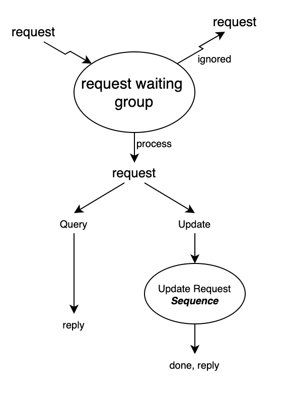
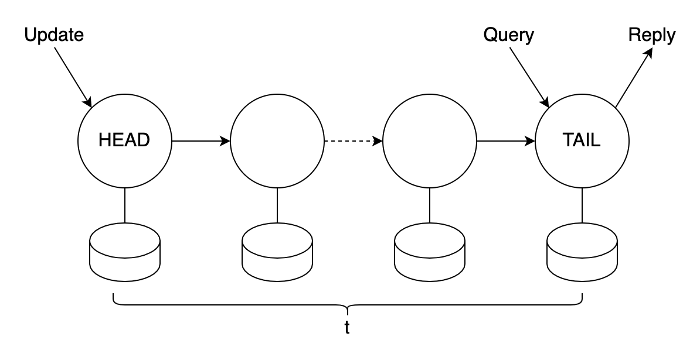

# Chain Replication

This blog is based on the [paper](https://pdos.csail.mit.edu/6.824/papers/cr-osdi04.pdf) mentioned in MIT 6.824. This paper introduces the concept and implementation details of a specific replication format and proves its correctness

## Introduction

Chain replication is a new approach to coordinating clusters of fail-stop storage servers, supporting large-scale storage services. The storage service stores objects, and provides query and update operations to these objects. It is somewhat in the middle of database and file system, which means it provides read/write locks with less expensive costs.

The storage system provides high availability and high throughout with strong consistency guarantees. The paper also compares it with traditional primary/backup method and proves it has superior performance, though this storage system, *chain replication*, is actually an instance of primary/backup approach.

## Interface

Chain replication provides two kinds of interfaces: query and update, or in other words, read and write. We all know Query operations are idempotent, but update operations need not be. So trigger a query before update could help to avoid duplicated updates.

The whole process of dealing with both kinds of requests are not complicated, just as shown below:

Requests are inserted into the request waiting group, and processed according to its kind. The update requests would be put into a sequence to guarantee updates are done in order.

## Protocol

What is fail-stop? First, each server halts in response to a failure rather than making erroneous state transitions, and second, a server’s halted state can be detected. Because of the structure of chain replication, as many as t−1 of the servers can fail without compromising the object’s availability:

The reply for every request is generated and sent by the tail, and each query request is directed to the tail of the chain and processed there atomically. While each update request is directed to the head of the chain. The request is processed there atomically, then state changes are forwarded along a reliable FIFO link to the next element of the chain (where it is handled and
forwarded), and so on until the request is handled by the tail.

For fault-tolerance, each server maintains a list of update requests it receives but not forwards to its successor, and each time its successor crashes, it will sends the list to the new successor to avoid losing requests. The successor, on the other hand, should confirm it has received the request backward, but not respond directly. The confirmation should start from the tail, and only after the tail receives the update request, would it send a *ack* message to its predecessor, and the predecessor would forward the message to its own predecessor after removing the request from its list, and so on. 

In this way, we could see that the predecessor is always fresher than its successor, which means it has received more requests than its successor. But the commitment is done at the tail, so that clients could only read from the tail, and write at the head. The rule is simple, but necessary. For example, once the ack-forwarding mechanism has been disobeyed, and the predecessor node could commit immediately by receiving ack from its successor, let's say the head, it responds once it sends the request to its successor and the successor responds ack message immediately after applying the request without it sending to its own successor (but it could do it later to replicate the state changes), the client could see incorrect result later if a middle server breaks, and the update request fails to be forwarded to the servers behind the middle server to the tail. This would cause diverge between the two parts of servers on the chain.

## Coping with server failures

The failures could be classified by its targeted servers' positions:

1. Head server: The head's successor would become the new header, and the old head server would be removed.
2. Tail server: The tail's predecessor would become the new tail, and the old tail server would be removed.
3. Middle server, or other servers: it works like removing a node from a link list, but operations described should be taken to avoid losing requests.

As we can see, it could be pretty easy to deal with failure happened to head and tail servers. Additional operations and data are required to deal with middle server failure, but it is still not hard to understand.

Another requirement is that once the chain becomes too short, it has to be extended for high availability. The process looks like adding a new node at the end of the chain and making it the new tail, but there are some details. During replicating objects and their modification from the old tail server to the new one, the old tail server still works as normal and provide all its functions. But it should maintain its recently received requests from replicating in a list, and all the updates should also be replicated to the new tail. Once the new tail becomes established, it works as the whole-function tail server, and the old tail becomes a common middle server.

## Summary

Chain replication supports high throughput for query and update requests, high availability of data objects, and strong consistency guarantees. The clients would not figure out the difference between transient outages and lost message. They are hidden by the system. And as the tradeoff, chain replication does not offer graceful handling of partitioned operation, trading that instead for supporting all three of: high performance, scalability, and strong consistency.

For me, the key point of chain replication is that updates are sent to all replicas whereas queries are processed only by replicas known to store all completed updates. This is important, because in different distributed, the core topic must be dealing with write operations and how to synchronize these operations across different instances. The chain replication is pretty simple and easy to understand, but its flaws are obvious: compared to mechanism where changes could be committed by **majority**, it requires **all**; there are only one server to deal with read operations, which would limit its performance of reading.

