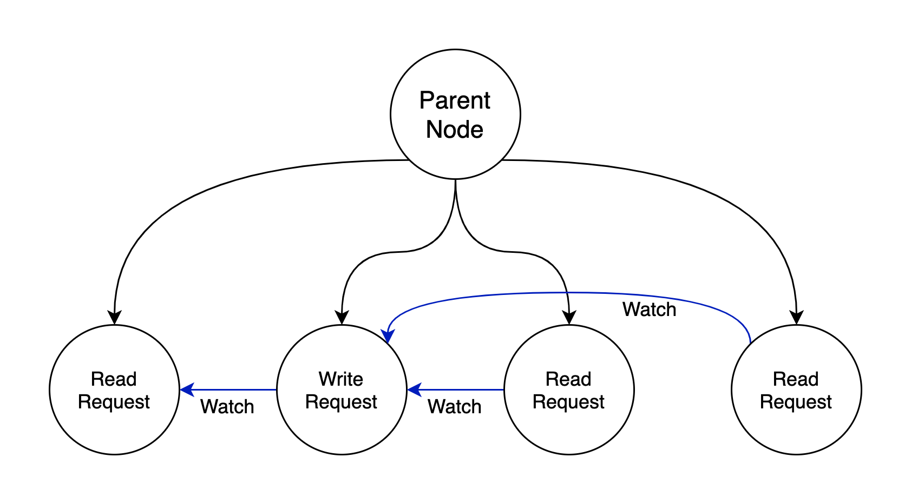

# ZooKeeper

This blog is based on the [paper](https://pdos.csail.mit.edu/6.824/papers/zookeeper.pdf) required by MIT 6.824 course, which introduces the concepts and usage of ZooKeeper.

## Introduction

ZooKeeper is a service for co-ordinating processes of distributed applications, working as the infrastructure of client services. It is the kernel for building more complex coordination primitives at the client, called *coordination kernel*. The interface exposed by ZooKeeper has the wait-free aspects of shared registers with an event-driven mechanism similar to cache invalidations of distributed file systems.  ZooKeeper also provides a per client guarantee of FIFO execution of requests and linearizability for all re- quests that change the ZooKeeper state.

ZooKeeper provides order guarantees for operations: *FIFO client ordering* of all operations and *linearizable writes*. And it uses replication to achieve high availability and performance, which allows clients to submit operations asynchronously. Servers process read requests locally, and ZooKeeper uses a watch mechanism to enable clients to cache data without managing the client cache directly.

## ZooKeeper Service

ZooKeeper provides a lot of APIs for clients to use, and its client library also manages network connection. 

### Overview

ZooKeeper provides to its clients the abstraction of a set of data nodes (znodes), organized according to a hierarchical name space. The path of a znode could look like: `/app1/p_1`. As for the naming rules, when creating a znode, clients could a set a *sequential* flag to force the sequence value of the newly created znode greater than any other znodes' sequence values under its parent node.

The watch mechanism is also an interesting implementation, because it only *informs* clients, but clients need to check the changes by themselves. Watches are one-time triggers associated with a session; they are unregistered once triggered or the session closes.

### APIs

ZooKeeper provides a lot of different APIs, and they have both a synchronous and an asynchronous version. The ZooKeeper client guarantees that the corresponding callbacks for each operation are invoked in order, and it only uses path to access znodes, instead of handles. Update methods take an expected version number used for validation, but could be ignored.

ZooKeeper holds two guarantees:

1. **Linearizable writes**:  all requests that update the state of ZooKeeper are serializable and respect precedence (*A-linearizability*, asynchronous linearizability)

2. **FIFO client order**: all requests from a given client are executed in the order that they were sent by the client

For example, the new leader can designate a path as the *ready* znode, and it deletes the ready znode firstly, and then updates the various configuration znodes, and create ready in the end. In this way, other processes will only use the configuration when that znode exists, to avoid to read partial configuration or configuration under modification. And to avoid process from seeing the ready znode before leader does changes to it, ZooKeeper guarantees that the client will see the notification event before it sees the new state of the system after the change is made.

 ZooKeeper provides a `sync` method to deal this scenario: because read happens locally, if one replica is behind another, it could not see the changes made by its peer on another replica and synchronized to it then. `sync` causes a server to apply all pending write requests before processing the read without the overhead of a full write.

### Examples

ZooKeeper’s ordering guarantees allow efficient reasoning about system state, and watches allow for efficient waiting.

1. **Configuration Management**: because of watch mechanism, processes will always see the newest configuration

2. **Group Membership**:  ephemeral nodes allow us to see the state of the session that created the node, which should be under a parent znode and could be retrieved by going through the parent znode's children

3. **Simple Locks**: the lock is represented by a znode, and processes are trying to create the znode, and the successful one is recognized to hold the lock

4. **Simple Locks without Herd Effect**: following the order of request arrival, each request should create its own represent znode, and the client only watching the znode that precedes the client’s znode

5. **Read/Write Locks**: write request watches its preceding requests, and read request only watches its preceding write request, all represented by znode

   

6. **Double Barrier**: processes firstly create their *ready* znodes, and enter barrier together when the number of znodes exceed the threshold; they delete their znodes when finishing their work, and exit altogether when all *ready* znodes are deleted

## ZooKeeper Implementation

ZooKeeper provides high availability by replicating the ZooKeeper data on each server that composes the service. Each ZooKeeper server has a in-memory database, containing the entire data tree. And designers force writes to be on the disk media before they are applied to the in-memory database for recoverability.

Different from Raft, every ZooKeeper server services clients, and clients connect to exactly one server to submit its requests. Clients would read data from its connected server locally, but write requests are forwarded to a single server, called the *leader*. And other servers are called *follower*. 

### Request Processor

To guarantee that the local replicas never diverge, ZooKeeper would transfer every write request into a transaction. To be more specific, ZooKeeper would calculate the state after the request has been applied, and then uses a transaction to capture this state. In this way, version numbers and time stamps could be used for validation.

### Atomic Broadcast

All requests that update ZooKeeper state are forwarded to the leader. The leader executes the request and broadcasts the change to the ZooKeeper state through Zab, an atomic broadcast protocol. Zab and ZooKeeper can only work if a majority of servers are correct, because Zab relies on this to decide on a proposal.

Zab guarantees that changes broadcast by a leader are delivered in the order they were sent and all changes from previous leaders are delivered to an established leader before it broadcasts its own changes. In brief, leader would never lose data and keep them in order.

use the log to keep track of proposals as the write-ahead log for the in-memory database, to avoid write messages twice to disks (one time for leader, one time for follower, and both replaced by recording this proposal).

Zab may redeliver a message during recovery. Because we use **idempotent** transactions, multiple delivery is acceptable as long as they are delivered in order.

### Replicated Database

Each replica has a copy in memory of the ZooKeeper state. ZooKeeper uses periodic snapshots and only requires redelivery of messages since the start of the snapshot. This snapshot, however, could be slightly different from this concept in Raft, and called *fuzzy snapshot*. Because when doing snapshot, state changes are not blocked, and the snapshot may contain some partial states which never appear as ZooKeeper's state. However, it does not matter at all, because transactions are idempotent, only if transactions after the time point of starting snapshot could be redelivered, the state would come to correct in the end.

###  Client-Server Interactions

When a server processes a write request, it also sends out and clears notifications relative to any watch that corresponds to that update. Read requests are handled locally at each server. Servers process writes in order and do not process other writes or reads concurrently. Each read request is processed and tagged with a *zxid* that corresponds to the last transaction seen by the server. This zxid defines the partial order of the read requests with respect to the write requests.

However, this mechanism could cause clients to read stale values, and To guarantee that a given read operation returns the latest updated value, a client calls `sync` followed by the read operation.

The client is guaranteed to be able to find another server that has a recent view of the system since the client only sees changes that have been replicated to a majority of the ZooKeeper servers. If the client session fails, the leader could detect it without receiving messages from the client in a period; if the server fails, the client needs to switch to a new server before the session expires and makes the leader think the client fails, but before switching, the client needs to send heartbeat message to verify whether the server fails or not.

## Summary

ZooKeeper takes a wait-free approach to the problem of coordinating processes in distributed systems, by exposing wait-free objects to clients without using locks. All these approaches described above make ZooKeeper the kernel for distributed applications with high performance.