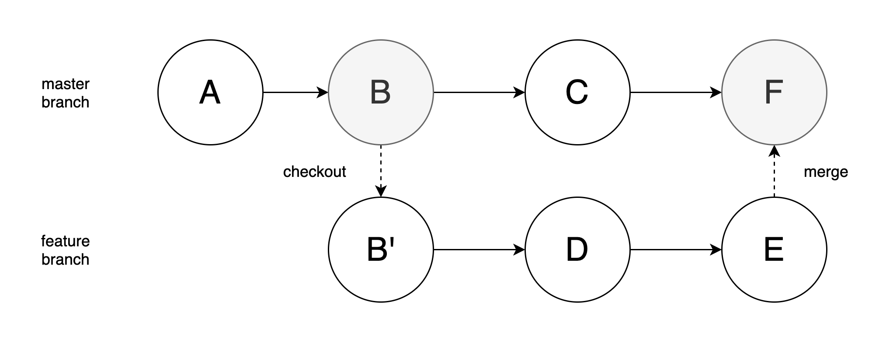
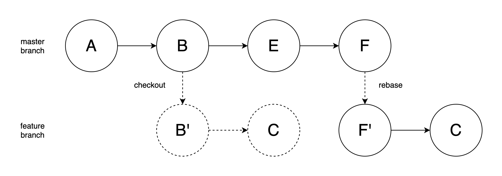

# How to use Git in work

In this note, I want to list some git usage that I am not so familiar with when I started to work and cooperate with my teammates at company. So some basic usage like **add**, **commit** or **log** are not included.

## Git rebase

### Usage 1

when we deal with our work with Git, we know what we should do: first, we checkout a new branch from the master branch to finish a task; second, we make some changes; third, we commit these changes and push this branch to remote; finally, we merge the new branch in remote repository to the master branch.

Based on the former operation, we can get below image:



As we can see, if we use **merge** command, we would only get a commit that indicates a merge has happened. After we delete the feature branch, nothing useful would be left. Also, we should not modify the commit information of the merge commit, because there could possibly be some changes from other branches.

When our project is simple, it looks not so bad, but things could be not acceptable when the branch network becomes complicated and developer would get confused about that. In this way, we could use **rebase** command instead. The detail goes like this:

1. Checkout a feature branch from master branch
2. Make some changes on this feature branch
3. Find some changes have happened on the master branch
4. Use rebase command to apply those changes on master branch to your own feature branch, and put all your changes ahead of those changes

Then we get an image below:



By using rebase, we can keep our branch clean and simple. When we merge the feature branch to the master branch, it would be automatically successful. In other words, we can solve the conflicts in rebase process, instead of merge process. And at any time, we only have one single branch in fact, which would avoid conflicts in the future.

**Merge** method has another flaw, that is it would make commits from different branch mixed together and the whole history hard to understand. To deal with this, when we use GitHub web tool to merge two branches, it would provide a way named **Squash and merge**, which would make your all commits of the merged branch one and then merge into another branch. 

The command line order is pretty easy:

```bash
git rebase develop
```

Here `develop` is another branch, which has been pulled from remote repository earlier.

### Usage 2

Here is another usage of **rebase**: we can use it to compress our commits on one branch and make it simple. 

A generic scenario: the developer was assigned a requirement, and then she checkouted a new branch to implement it. She wrote, tested and debugged for a while and finally finished it. She needs to have another develop to help her review her code, but she just found that she committed too many times and there were tens of commits. Of course the reviewer can review her code from the last commit, but she wanted to make it cleaner. At this time, **rebase** can handle this.

```bash
git rebase -i [startpoint] [endpoint]
```

`-i` means `--interactive`, and generally we do not need to point the endpoint out, because it would point to HEAD commit by default. Also, when this order runs, startpoint would be included but endpoint would not.

Or, we can use a different way to identify how many commits we want to compress:

```bash
git rebase -i HEAD~3
```

This order makes Git compress the first three commits from HEAD commit.

## Git stash

When we have some code under development which has not been finished yet, and at the same time we need to switch to another branch. Or, when we want to pull some modification from remote branch immediately but unwilling to waste time to deal with conflicts with local changes. In these scenarios, we do not have to commit (perhaps committing unfinished changes is not a good idea) and **stash** order can help us. Only one line order:

```bash
git stash
```

And you are free to switch to any other branches or pull any modification. Later then when you get back to this branch, you can use:

```bash
git stash pop
```

to recover these changes and continue your work.

## Git branch rename

Though rare, I met this requirement some times. So here is the note:

As for the local branch, this command would be enough:

```bash
git branch -m old_name new_name
```

As for the remote branch, I just want to make it easy: delete it and push the local renamed branch again.

## Reset repository remote URL

I have experienced a migration of our repositories from the internal network to external network. And after the migration finished, I need to reset the url of remote repository:

```bash
git remote set-url origin {url}
```

Make the local branch of the repository track remote branch of the repository:

```bash
git push --set-upstream origin {branch name}
```

Then, I could work with git as I used to do with it.

## Checkout from a certain commit

This scenario is common: developers need to checkout from a certain commit for some reasons, and the command is simple:

```bash
git checkout <commitId>
```

And a detached HEAD would appear, which we are currently located at. We can checkout a new branch based on this:

```bash
git checkout -b branchName
```

The following operations would be as the same as normal operations on a feature branch.