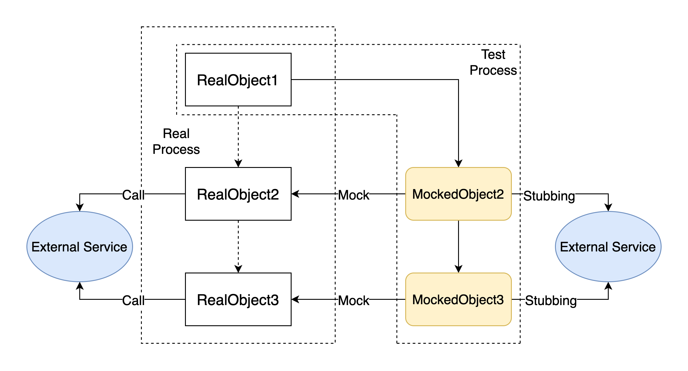

# Mockito Usage & Some Scenarios

Document reference:

[Mockito - 3.5.10 API](https://javadoc.io/static/org.mockito/mockito-core/3.5.10/org/mockito/Mockito.html#12)

## Basic Usage

### Create a mocked object

```java
Object mockedObj = mock(Object.class);
```

### Stubbing

```java
when(mockedObj.someMethod(...args)).thenReturn(something);
```

Note: what we return here (`something`) should match the type of return value of real method

**Another usage**

```java
doReturn(something).when(mockedObj).someMethod(...args);
```

**Difference**

When you need to deal with function that does not have return value (void), you have to use the **2nd** usage

Also there are some different stubbing method, like `thenThrow/doThrow` and `doNothing`

### Argument matchers

To match different types of values, Mockito uses the `equals()` method

```java
when(mockedObj.someMethod(anyInt(), anyString(), any(), eq("keyword")).thenReturn(something);
```

Also we can use customized matchers

### Verify behavior

```java
verify(mockedObj).someMethod(...args);
verify(mockedObj, times(2)).someMethod(...args);
verify(mockedObj, never()).someMethod(...args);
```

By using verify, we can check how many times the function has been called


## Generic Usage in a Class to be Tested

### To begin with

```java
@ExtendWith(MockitoExtension.class)
class SomeClassTest {
  
    @InjectMocks
    SomeClass someClassObj;
  
    @Mock
    SomeOtherClassToBeInjected otherClassObj;
}
```

In this manner, Mockito would know **someClassObj** is the object to be tested and inject **otherClassObj** into it. **@Mock** is a shorthand way to create a mock

In **SomeClass** class, things could go like this:

```java
// inject through annotation
public class SomeClass {
  
    @Autowried
    private SomeOtherClassToBeInjected otherClassObj;
}
```

Or, there could also be a constuctor like this:

```java
// inject through constructor
public class SomeClass {
  
    private SomeOtherClassToBeInjected otherClassObj;
  
    public SomeClass(SomeOtherClassToBeInjected otherClassObj) {
        // do something
    }
}
```

Both would work

### General Process

```java
// create mocked class object
Object1 mockedObject1 = mock(Object1.class);
Object2 mockedObject2 = mock(Object2.class);

// create real class object
Object3 realObject = new Object3();

// stubbing
when(mockedObject1.someMethod(anyInt(), anyString(), any(), eq("keyword"))).thenReturn(mockedObject2);
when(mockedObject2.someMethod(...args)).thenReturn(something);

// run test and verify
assertNotNull(someClass.testedMethod(realObject));
verify(mockedObject2).someMethod(...args);
```



In the test process, we can avoid calling the external service directly and *pretend* that we have called it and got the expected return values (this is what Mockito does), so that we can ensure our unit test would go smoothly and get rid of the influence from external service


## Troubleshoot

Mockito can be powerful, but sometimes there could be some difficulty

### Scenario - How to test sentence like new class() ?

```java
public class SomeClass {
    // ...
    public SomeOtherClass = new SomeOtherClass(...args);
}
```

**note**: Mockito **could not** deal with this way to create a new class inside the class to be tested, so avoid this and use factory method to replace it

### Scenario - How to mock a generic class ?

```java
ResponseEntity<String> responseEntity = (ResponseEntity<String>) mock(ResponseEntity.class);

// or we can ommit the type conversion
ResponseEntity<String> responseEntity = mock(ResponseEntity.class);
```

### Scenario - How to match argument like String.class ?

Matchers **should not** be combined with raw values:

```java
// in class to be tested
public void methodToBeTested() {
    // ...
    realObject.someMethod(someObj, String.class);
}

// in test class
@Test
public methodToBeTested() {
    // this is valid
    when(mockedObject.someMethod(any(), ArgumentMatchers.<Class<String>>any())).thenReturn(something);
  
    // this is invalid
    when(mockedObject.someMethod(any(), String.class));
}
```

But if arguments are not mixed, `String.class` argument would work:

```java
// in class to be tested
public void methodToBeTested() {
    // ...
    realObject.someMethod(String.class);
}

// in test class
@Test
public methodToBeTested() {
    // this is valid
    when(mockedObject.someMethod(ArgumentMatchers.<Class<String>>any())).thenReturn(something);
  
    // this is also valid
    when(mockedObject.someMethod(String.class));
}
```

### Scenario - How to stub static method ?

Mockito did not support stubbing for static method until 3.4.0, though it still contains some bugs which were fixed after 3.4.6 

We could do it like this:

```java
try(MockedStatic<ReflectUtils> staticMock = Mockito.mockStatic(ReflectUtils.class)) {
    staticMock.when(() -> ReflectUtils.getPrivateObjectFromClassInstance(object, "objName")).thenReturn(something);
    // other stubbing
}
```

**note**: the stubbing of static method is limited in the **try** scope

Also, sometimes we need to mock multi static methods, and they should be separated by `;`:

```java
try(MockedStatic<ReflectUtils> staticMock1 = Mockito.mockStatic(ReflectUtils.class);
    MockedStatic<HttpUtil> staticMock2 = Mockito.mockStatic(HttpUtil.class)) {
    staticMock1.when(() -> ReflectUtils.getPrivateObjectFromClassInstance(object, "objName")).thenReturn(something);
    staticMock2.when(() -> HttpUtil.createPost(anyString())).thenReturn(httpRequest);
    // other stubbing
}
```

In some more special scenarios, we need even mock static methods without any return values. The difficulty is, I have not found any way to mock this kind of static methods directly. Looks like `doNothing()` pattern is not supported here.

The solution is to use `Answer`, an interface provided by Mockito, which allows test programmers to change the behavior of mocked methods, like changing types of return values. Here is an example:

```java
public class SleepUtils {
    public static void timeSleep(long second) {
        TimeUnit.SECONDS.sleep(second);
    }
}
```

In unit tests, we do not want to slow the speed by making `timtSleep()` work in reality. So we can mock it like this:

```java
Answer answer = new Answer() {
    @Override
    public Object answer(InvocationOnMock invocation) {
        return 0;
    }
};

try(MockedStatic<SleepUtils> staticMock = Mockito.mockStatic(SleepUtils.class)) {
    staticMock.when(() -> SleepUtils.timeSleep(anyLong())).then(answer);
}
```

Or, there could be a better way with lambda expression:

```java
try(MockedStatic<SleepUtils> staticMock = Mockito.mockStatic(SleepUtils.class)) {
  	staticMock.when(() -> SleepUtils.timeSleep(anyLong())).then(invocation -> 0);
}
```

Thanks to IDEA, which helped me to simplify my code.

So in this way, we can avoid the delay of `timeSleep()` in our unit test.

Reference:

[Mockito can mock static methods!](https://asolntsev.github.io/en/2020/07/11/mockito-static-methods/)

[Stack Overflow - Mocking static methods with Mockito](https://stackoverflow.com/questions/21105403/mocking-static-methods-with-mockito)

### Scenario - How to change stubbing ?

Sometimes we need to change the behaviour of our former stubbing, and in this way, we could **only** use `doReturn/doThrow` method

```java
doReturn(someThing).when(mockedObj).someMethod(...args);
assert(...);
verify(...);
doReturn(otherThing).when(mockedObj).someMethod(...args);
assert(...);
verify(...);
doThrow(someException).when(mockedObj).someMethod(...args);
assert(...);
verify(...);
```

We **must not** use `thenReturn/thenThrow` method, because the stubbing would never be changed by later stubbing, but only the first stubbing lasts

### Scenario - How to stub chain invokes ?

We may face code like this:

```java
obj.func1().func2().func3();
```

Obviously we only care about the result returned by `func3`, instead of all other results in the process of invoking. But with all out former knowledge, it looks like the only way to stub this kind of invokes is to mock all the return values in the process, and make stubbing on them. Luckily, there is a better way provided by Mockito:

```java
Obj ob1 = mock(Obj.class, RETURNS_DEEP_STUBS);
// here we can do stubbing in one process
when(obj.func1().func2().func3()).thenReturn(something);
```

Looks like this kind of stubbing is only supported in `when().then()` pattern, to which we should pay attention.

Also, for mocked objects injected by annotation:

```java
@Mock(answer = Answers.RETURNS_DEEP_STUBS)
Obj obj;
```

When being used, things are similar to above description.

### Scenario - How to return an input parameter ?

Sometimes we could have some requirements like just return the input parameter of a stubbing. For example, I used to plan to have a method tested, while it has a deep invocation: at the end of `method A`, it invokes `method B`; at the middle of `method B`, `method C` is invoked, and so on. In fact, I just want to fetch the instance passed to `method B` and have it checked. So this is what I did:

```java
Service service = spy(Service.class);
doAnswer(i -> i.getArguments()[0]).when(service).methodB(any(someClass.class));
assertEquals(40, service.methodA(obj1, obj2).getCount());

// methodA defination:
public Obj3 methodA(Obj1 obj1, Obj2 obj2) {
    // process ommitted
    return methodB(obj3);
}
```

Things can be as easy as one line with `doAnswer` and a lambda expression inside. In this way, the invocation would be interrupted when invoking `methodB`, and the target object would be returned directly. The `i.getArguments()[0]` indicates we want the first input parameter of the parameter list of `methodB`. 