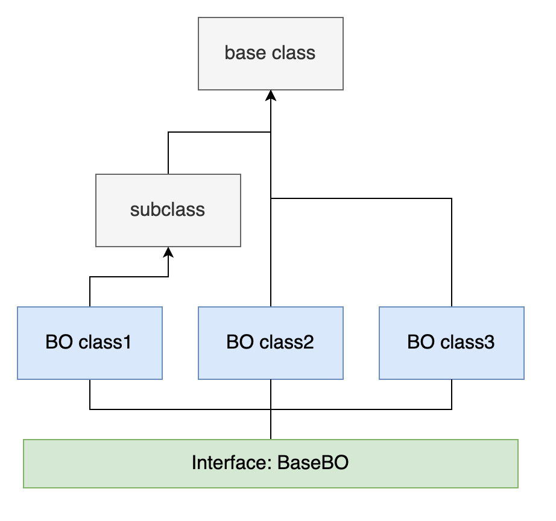

# Service Setup and Some Thoughts

## Background

Recently I was working on a new project, responsible for setting up a new repository, a microservice. During this period, I have met one thing weird.

In our team, we are applying DDD (*Domain Driven Design*) in our services' structures. As the result, I created a lot of services, business objects and repositories. After some analysis, I realized that the most of behavior were the same in services, business objects and repositories respectively. So that I used to a base class to replace these respective objects. But there is something requiring special cares: the business object and repositories have already inherited from their parent classes, and in this way, no other base classes are allowed. I had two choices at that point:

1. Use classes extending the base classes, and make my BO and repository classes extend them;
2. Use interfaces and make subclasses implement it.

The first one was proved unpractical then, because in fact one of the BOs and repositories extended another subclass of the base class, shown in this diagram:



This diagram shows the inheritance structure of business object, and the same to the repository class. And I need to pass the type of the BO to the repository class, as well as the types of BO and repository to the service class together. Because all of them are generic when writing code, so it would be necessary to have interfaces to indicate some common behavior. These behavior would be called in services then.

As for the services, they did not have these annoying inheritance relationships, and all I needed to do was to design a base class to provide all the common APIs, that is to say, to provide **CRUD** APIs to external. I designed it as an abstract class, though I provided default implementation for all its methods. I have also considered to use a concrete to provide these basic APIs, but I was not sure whether we need to provide more common methods in the future, and it there were some methods remaining for subclasses to implement, things could be tricky then. In addition, there are some injected fields in the abstract class, and all the methods are relying on these fields. So interfaces were no longer a valid choice.

## Troubles & Solutions

There are a lot of things the development framework I am using done for me. So that I do not need to care about the database operation: JPA does it. But there are still something need paying attention to:

### Be careful when naming database tables

I am using **PostgreSQL** as the database engine, and this service mainly focus at users of our system. So naturally I name the table of our users as *user*. This is disastrous: When I try to pick up a user from the database, though its detail is covered by JPA, the SQL used looks like:

```sql
SELECT * FROM user u WHERE u.id = xxx
```

In fact, this SQL only picks the user's name of current database session, instead of the user I want. This also applies to other queries on this table. The **user** is a keyword indeed, it should never be used as a table name.

This bug was not found locally at first, because it was pointed out which schema in the SQL at local. And then the SQL would look like:

```sql
SELECT * FROM schema_name.user u WHERE u.id = xxx
```

This would not cause the former bug.

Anyway, this ends up with renaming of the table.

### Be careful when creating ObjectMapper instance

In my code, I used **ObjectMapper** to convert strings in JSON format to the target objects. At first, I created a new object in methods:

```java
public void method() {
    ObjectMapper objectMapper = new ObjectMapper();
}
```

My colleague pointed it out truly a bad design, because evert time invoking this method, a new ObjectMapper instance would be created, which could bring negative influence on performance. What's more, the ObjectMapper instance is only created and used once in the whole class, so that a good design should be like this:

```java
public class ClassA {
    public static final ObjectMapper objectMapper = new ObjectMapper();
    
    public void method() {
        // invoke the static objectMapper
    }
}
```

In this way, the ObjectMapper instance would be only created once when the class is initializing. Because it is also a Spring Bean, which indicates it is a singleton component, the instance would only be created once in the whole lifecycle of this service. Of course it would save a lot of resource.

### Be careful when updating an object

I prefer this way to update an object:

1. Query from the database to see whether the object exists, according to the query conditions.
2. If not, throw an exception or create a new object or anything else in different scenarios.
3. If so, I update the existing object according to the data passed in and write it back to the database.

It looks easy, but some details are definitely important: First, I believe we should not use the business object carrying the data needed to be updated directly, like this:

```java
public void update(BusinessObject BO) {
  // omitted
  repository.update(bo);
}
```

We could not guarantee that the business object would not be modified during update, or any other unexpected operations to it. In fact, in *Effective Java*, the author mentioned that it was best to copy the object before using its data, and this rule perfectly applies to this scenario.

Also, it would be bad idea to set all the fields of the business object directly without checking its fields' validation, because it would introduce null values to the database. Luckily, the framework provided a useful tool to read values from source objects which are not null and write them to the destination objects.

### Be careful when using annotations

We all know that database operations should be in transactions, and Spring provided an annotation `@Transactional` to achieve this. If you still remember that my services are extended from a base service and all the common behavior is implemented in the base class. I just added the annotation on subclasses, and not on the base class.

The behavior was wired at first: When I commit a change on a record, and in the same request, I could confirm the change on the record. But after the request (the call chain) finished, all the changes would be lost. I knew there was something wrong with the transaction, but I could not figure out why. Because in my assumption of using the annotation, it would also applies to the ancestor class, because the subclass extends the base class, and truly we call methods from subclass objects, instead of base class object, so that of course all the annotations would apply to ancestor classes. This is totally wrong, however.

In fact, the annotation would apply to all the members of the subclass object hold it. In fact, it is just an interface. We know how the Java VM call the methods in a class object from stack, and the methods of the base classes would not have contact with external fields, as well as annotations.  In this way, annotations of subclasses would not apply to ancestor classes.

The conclusion is clear: The annotation `@Transactional` should be applied to the base service class directly. And by reading the comment of the annotation, I found it expressed clearly:

> At the class level, this annotation applies as a default to all methods of the declaring class and its subclasses. Note that it does not apply to ancestor classes up the class hierarchy; methods need to be locally redeclared in order to participate in a subclass-level annotation.

I have to say I missed this when coding. A good lesson for me!

## Dive deeper

Now we know annotations could not be applied to ancestor classes, then could annotations of ancestor classes be applied to subclasses? It depends.

There are some positive answers under some scenarios:

1. `@Inherited`: A meta annotation, and with it, annotations could be inherited, limited in class level.
2. If the subclass does not override the methods of ancestor classes with annotations, these annotations would still work when calling these methods. (In fact these methods are directly called within ancestor classes, and of course these annotations work)
3. Similiar to the last item, annotations of interfaces work the same way. (Only after JDK 8)